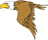
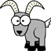

# Mountain Climber

The purpose of the game is to climb as high as you can by jumping from wall to wall while
avoiding obstacles. There will be animals that make you fall as well as those that act
as powerups.

----

## 1. Game Objects/Things
#### Static Object

This will be my static object that will not move like the other things in the game. From this
class I will derive the walls, icicles, and rope. If the user touches the icicle, they will fall
off and die. It will stick out along the wall, making the user jump across to avoid it. The wall
and rope will just scroll down as the timer runs.

#### Bird

The bird will fly across the screen randomly, probably along a slightly curved path. If
the user touches during gameplay, then they will fall and lose the game. The bird should be
a simple image imported into the program.

#### Goat

The goat will act like a "bonus" to add to the users score if they user collides with the goat.
There will be a rope (static object) that goes between the two walls on each side of the window and
the goat will move across this rope, randomly changing directions. The goat as well as the
rope (two separate objects) should be simple images imported into the program. (The user will
be able to go through the rope).

#### Star

The star will move jump across each side of the screen (or each wall of the mountain),
making it difficult to catch. It will be relatively small. The star will be able to go
through obstacles like icicles and will go across the screen randomly. If the user catches
(or collides) with it, then the user will become "invincible" for a certain time (being
unaffected by birds and icicles) as they would run through/clip the things that normally
would make them fall. The score label will indicate when the player in invincible by turning
green. The star will not show up very often and will be from an imported image.

#### Monkey

The monkey will climb up and down along the walls. If the player comes in contact with
a monkey, then they will fall down and lose. The monkey will not jump across the screen,
rather, it will only stay on one side where it will ascend and descend randomly (being able
to go through icicles along the wall). It will be created from an image on the internet.

----

## 2. Gameplay
Gameplay will be controlled just by the space bar where the character will switch sides
(going from wall to wall on each side) upon press. The player will need to switch sides
in order to avoid enemies or obstacles that will cause them to fall. The player will be running
up the "mountain" or screen during game play, which will increase in speed as the user gets
higher up the mountain.

----

## 3. Score Tracking
Score will be tracked by how high the player gets (the higher up the mountain, the higher the score).
There will also be goats to add bonuses to the score. There is no way to have your score go down.

High scores are kept track of by saving scores with usernames to a .txt file. When a game is completed
(when the player dies), the score is saved to the file. The next time the game is opened, the list
of high scores will be displayed. See example-Score.txt for sample file that is created.

----

## 4. Player Life Tracking
When the player falls or touches an enemy, they die and the game ends. They will not have lives,
the player will have to go as high as they can in one life.

----

## 5. User Interface Design
Only the space bar will be used for gameplay. There will also be a listener for "P" that will
pull up the menu if pressed. Everytime the space bar is pressed, the player will jump to the
other wall on the screen. The player should be held in the same place while the everything
else on the screen should scroll down, giving the effect of climbing up.

